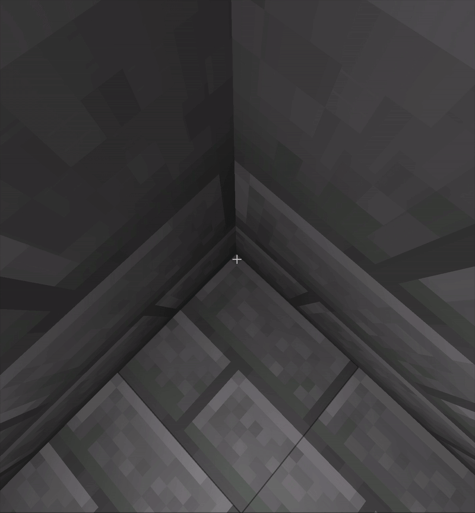
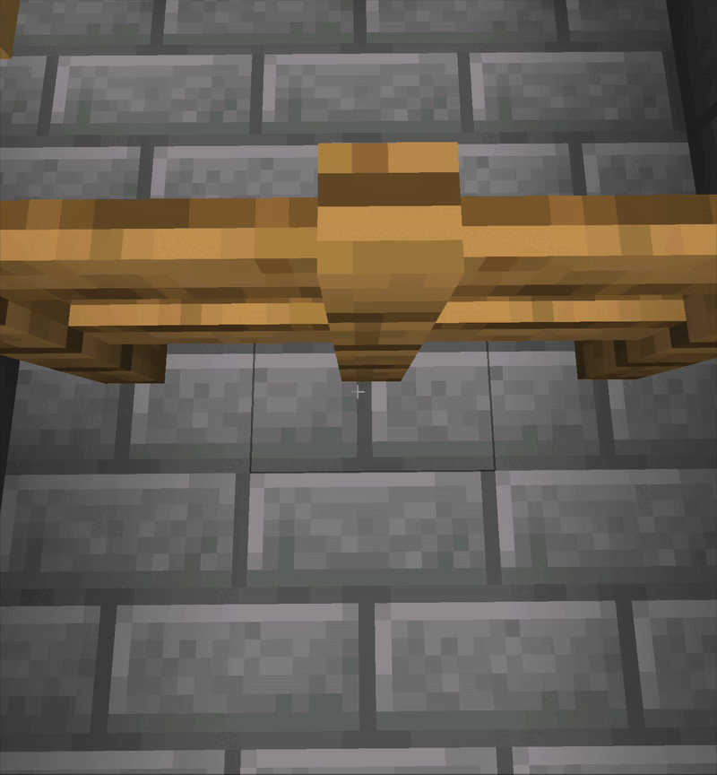
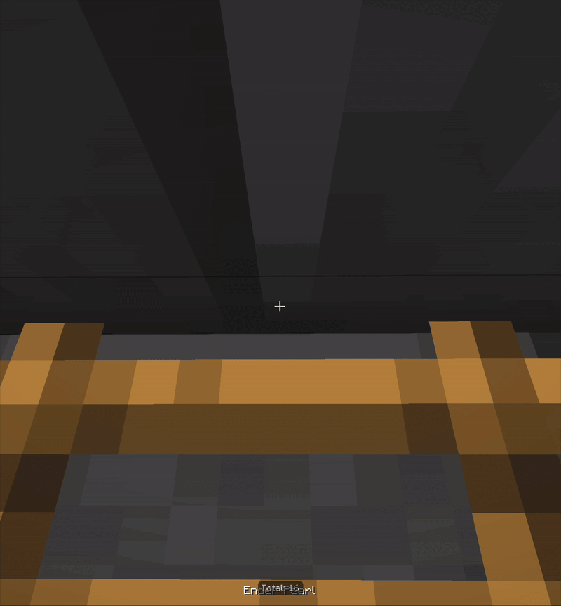

    <h1>PearlFix</h1>

## Description
**PearlFix** is a Minecraft server plugin that aims to fix the notorious Ender Pearl clipping bug (see: [MC-2164](https://bugs-legacy.mojang.com/browse/MC-2164)).

While Mojang has made attempts to address this issue in the past, it still remains in the game to this day. PearlFix provides a reliable method to prevent players from clipping into or through blocks when using Ender Pearls.

## Showcase

  
  
  

## How it works
When an Ender Pearl is thrown, PearlFix starts a task that runs every tick while the pearl entity remains valid.

**Each tick:**
- The player’s hitbox is calculated and scaled based on the configured mode.
- All nearby blocks that could potentially collide with the player’s bounding box are checked.
- If the current pearl location is considered **safe**, it is stored as the last known safe location.
- Unsafe locations are ignored.

When the Ender Pearl lands, PearlFix verifies whether the current location is safe.  
If it is not, the player is instead teleported to the **last recorded safe location**, preventing block clipping.

Debug: enabled · Mode: Full Body (for better visibility)

This approach ensures every location is safe before teleporting players, and also covers edge cases where pearls collide with corners, slabs, fences, or other non-full blocks.

## Supported Versions
PearlFix currently supports Minecraft versions **`1.20.5–1.21.x`**.

Support for additional versions may be added in the future, or upon request via an issue if absolutely necessary.

## Permissions
- `pearlfix.reload` – Allows reloading the plugin configuration.

## Installation
1. Download the latest release from the **Releases** page.
2. Place the plugin JAR file into your server’s `plugins` directory.
3. Configure the `config.yml` file located in `plugins/PearlFix/` as needed.
4. Apply changes using the `/pearlfix reload` command.

## Licence
This project is licensed under the [GPL3 License](LICENSE).